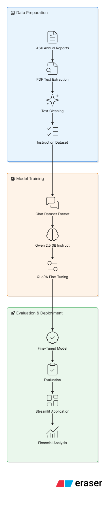
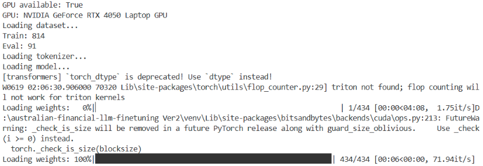
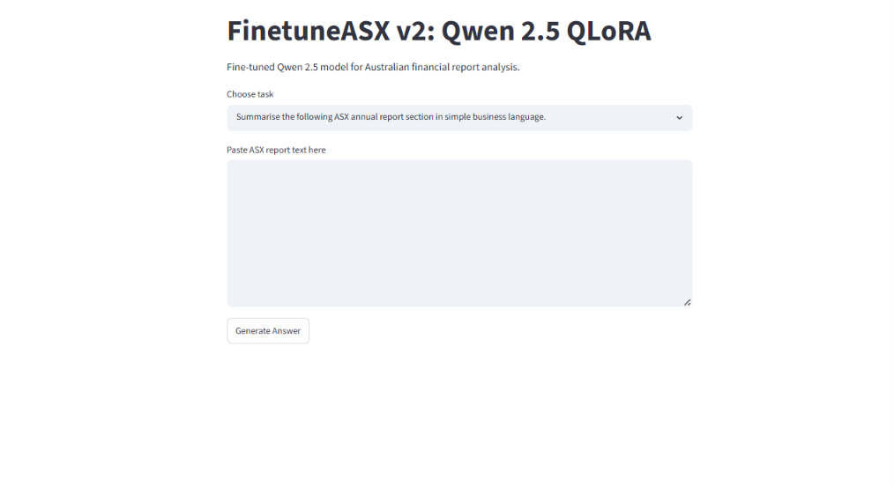
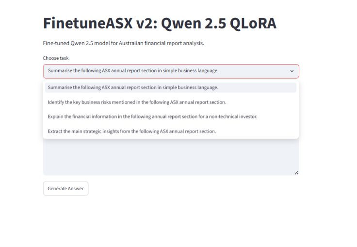

# 🇦🇺 FinetuneASX V2 – Australian Financial LLM Fine-Tuning with Qwen 2.5 & QLoRA

An end-to-end Large Language Model (LLM) fine-tuning project built using Australian Securities Exchange (ASX) annual reports and the Qwen 2.5 3B Instruct model.

This project demonstrates the complete workflow of:

* Financial document collection
* Text extraction and preprocessing
* Instruction dataset generation
* Chat dataset creation
* QLoRA fine-tuning using Hugging Face Transformers
* GPU training with NVIDIA RTX 4050
* Model evaluation
* Streamlit deployment

---

# 🚀 Project Overview

The objective of this project was to explore whether a modern instruction-tuned open-source language model can be adapted to understand Australian financial reporting terminology and perform domain-specific tasks.

Unlike my previous **ASX RAG Assistant**, which retrieves information from documents, this project focuses on modifying the model itself through parameter-efficient fine-tuning.

The model was trained to perform:

* Financial Summarisation
* Risk Extraction
* Financial Explanation
* Strategy Insight Generation

---

# 🎯 Why This Project?

Australian financial reports contain terminology and reporting structures that differ from US-centric datasets.

Examples include:

* ASX reporting standards
* Australian banking terminology
* Australian regulatory disclosures
* Company-specific risk reporting
* Investor-focused financial commentary

This project investigates whether a modern open-source language model can be adapted to better understand Australian financial documents.

---

# 📂 Dataset

## Source Documents

ASX-listed company annual reports including:

* ANZ
* NAB
* BHP
* CSL
* Woolworths
* Wesfarmers
* Coles
* Telstra
* Qantas
* and other major ASX-listed companies

---

## Dataset Origin

The instruction dataset used in this project was originally created in **FinetuneASX V1**.

V1 focused on:

* PDF text extraction
* Text chunking
* Instruction generation
* Dataset cleaning
* Financial instruction engineering

For V2, the cleaned instruction dataset was reused and converted into a conversational chat-format dataset suitable for modern instruction-tuned models.

Original dataset repository:

https://github.com/Shajeeran/australian-financial-llm-finetuning/tree/main/data/instruction_data

This allowed V2 to focus on:

* Chat dataset engineering
* QLoRA fine-tuning
* 4-bit quantisation
* GPU optimisation
* Modern LLM adaptation

---

## Relationship to FinetuneASX V1

| Version | Model                | Fine-Tuning Method |
| ------- | -------------------- | ------------------ |
| V1      | FLAN-T5 Base         | LoRA               |
| V2      | Qwen 2.5 3B Instruct | QLoRA              |

V1 focused primarily on dataset creation and baseline financial fine-tuning.

V2 focuses on adapting a modern instruction-tuned LLM using GPU-accelerated QLoRA fine-tuning and chat-based training data.

---

## Data Processing Pipeline

```text
ASX Annual Reports (PDF)
            ↓
      Text Extraction
            ↓
      Text Cleaning
            ↓
 Instruction Generation
            ↓
     Dataset Cleaning
            ↓
   Chat Dataset Format
            ↓
     QLoRA Fine-Tuning
            ↓
 Australian Financial LLM
```

---

## Dataset Statistics

| Metric               | Value |
| -------------------- | ----- |
| Companies            | 11    |
| Initial Examples     | 6,474 |
| Final Clean Examples | 2,883 |
| Tasks                | 4     |

### Task Distribution

| Task                  | Examples |
| --------------------- | -------- |
| Summarisation         | 813      |
| Risk Extraction       | 701      |
| Financial Explanation | 615      |
| Strategy Insights     | 754      |

---

# 🧠 Model Configuration

## Base Model

```text
Qwen/Qwen2.5-3B-Instruct
```

## Fine-Tuning Method

```text
QLoRA (Quantized Low-Rank Adaptation)
```

## Quantisation

```text
4-bit NF4 Quantisation
Double Quantisation Enabled
BitsAndBytes Backend
```

## Hardware

```text
NVIDIA RTX 4050 Laptop GPU
CUDA Enabled PyTorch
```

---

# 🏗 Project Architecture


### Architecture Flow




---

# 📸 Screenshots


### Qwen Model Loading & QLoRA Training




---

# 📊 Results

The project successfully demonstrates:

✅ Financial document preprocessing

✅ Instruction dataset construction

✅ Chat dataset generation

✅ GPU-based QLoRA fine-tuning

✅ 4-bit quantisation

✅ Streamlit deployment

✅ Financial-domain adaptation workflow

✅ Modern parameter-efficient LLM training

---


# 💡 Homepage & Tasks





---

# 💡 Example Use Cases


---

## Risk Extraction

### Input

```text
The company faces inflationary pressure, higher interest rates, supply chain disruptions and cyber security threats.
```

### Output

```text
Key business risks include:

• Inflationary pressure
• Higher interest rates
• Supply chain disruptions
• Cyber security threats


```


---

## Strategic Insights

### Input

```text
Management plans to invest in digital transformation, AI capabilities and customer experience initiatives.
```


### Output

```text
Strategic priorities include:

• Digital transformation
• Artificial intelligence adoption
• Customer experience enhancement
• Operational efficiency improvements
```


---

# 📚 Key Lessons Learned

This project provided hands-on experience with:

* LLM Fine-Tuning
* QLoRA
* Quantisation
* GPU Training
* Financial NLP
* Dataset Engineering
* Instruction Tuning
* Streamlit Deployment

### Biggest Lesson

> Dataset quality has a greater impact on model performance than simply increasing model size or training duration.

This project reinforced the importance of data-centric AI development.

---

# 🔄 Future Improvements (Version 3)

### Planned Enhancements

* Larger financial instruction dataset
* Human-labelled financial summaries
* Financial benchmark evaluation
* RAG + Fine-Tuning hybrid architecture
* Multi-document financial analysis
* Agentic financial research workflows

---

# 🏗️ Project Structure

```text
australian-financial-llm-finetuning-ver2/
│
├── app/
│   └── streamlit_qwen_app.py
│
├── data/
│   └── instruction_data/
│
├── models/
│
├── results/
│
├── screenshots/
│
├── src/
│   ├── build_chat_dataset.py
│   ├── check_chat_dataset.py
│   ├── train_qwen25_qlora.py
│   ├── test_qwen25_qlora.py
│
├── requirements.txt
├── README.md
└── .gitignore
```

---

# 👨‍💻 Author

**Shajeeran Manoharan**

AI Engineer | Machine Learning Engineer | Data Scientist

